  
## Install Instructions for PyCharm  
  
  
1. [Download](https://www.jetbrains.com/pycharm/download/#section=mac) latest version of GitHub (Community or Professional):   
 
2. Enter you GitHub credentials in Preferences -> Version Control -> GitHub. More details can be found [here](https://www.jetbrains.com/help/pycharm/settings-version-control-github.html).   
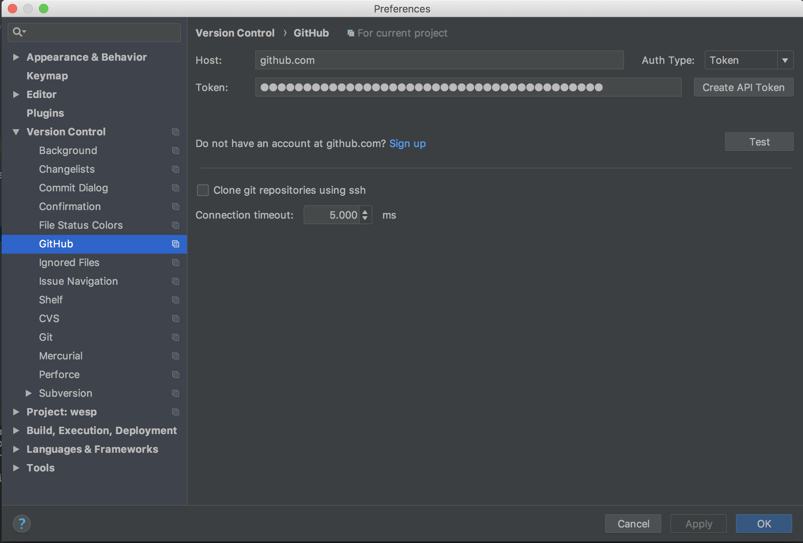    
  
3. Make a checkout of the repository: VCS -> Checkout from Version Control -> Git 
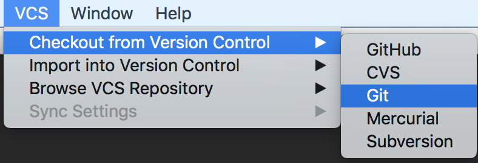  
  
4. Clone the repository (https://github.com/IsarNet/wesp/) to your computer. 
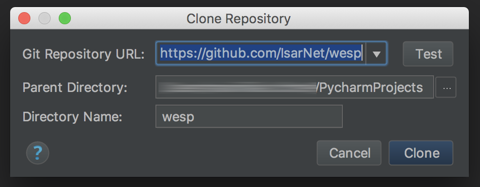  
  
5. Confirm the Checkout: 
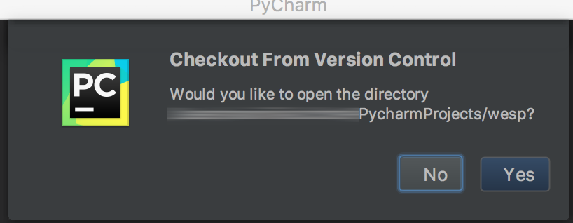  
  
6. Open the created project and go to Settings -> Project: wesp -> Project Interpreter. Here create a new local python interpreter, by clicking on the settings icon in the top right corner and selecting *Add Local...*
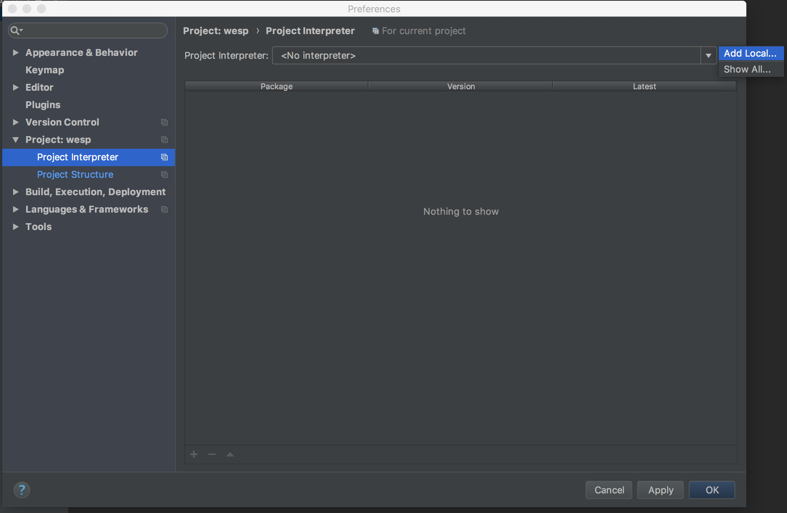  
  
8. Create a new python 2.7 interpreter or use the one from your OS. Hit *OK* to confirm. 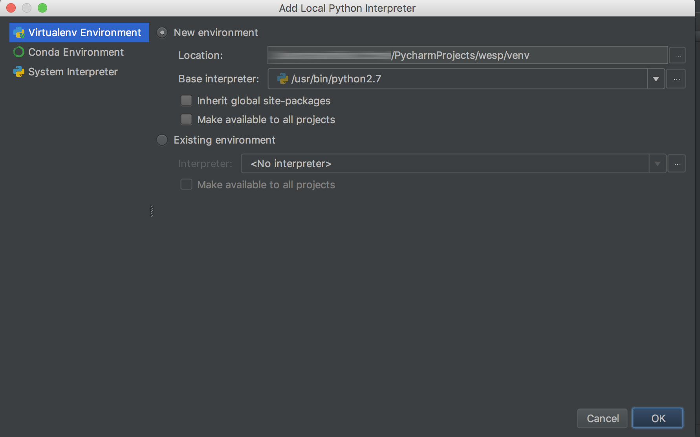  
  
9. Hit Apply.  
  
10. Select *Project Structure* from the right menu. Click on the *src* folder and mark it as *Sources* using the button on the top. Select the *venv* folder and mark it as *Excluded*.  Confirm everything by clicking on *OK*.
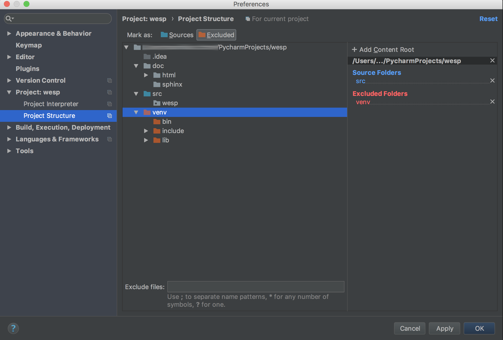  
  
11. Find the file *requirements.txt* from the Project Structure on the left and open it. Install the requirements using the yellow bar on the top (it may take a few seconds to appear). If something cannot be installed, make sure you use the newest version of PyCharm. 
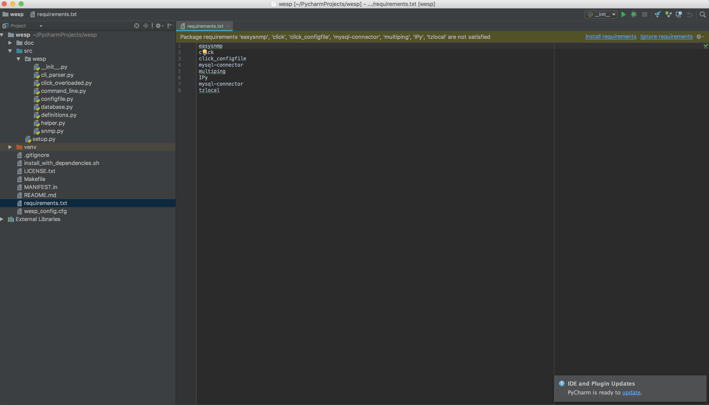  
  
12. Find the file *\__init__.py* in the module *wesp* of the folder *src*. Right click and select *Run '\__init__'.* 
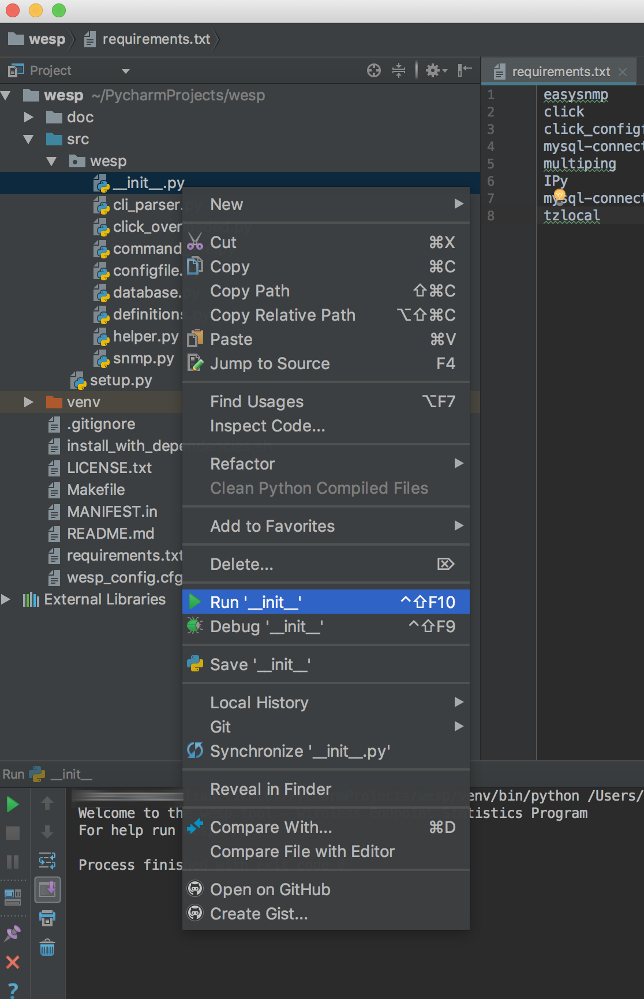  
  
13. The console should appear and print something like this: 
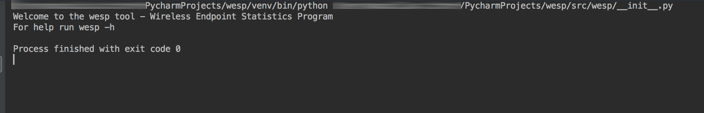  
  
14. You can now starting to develop. To add parameter to the execution change the Run Configuration: Run -> Edit Configurations. 

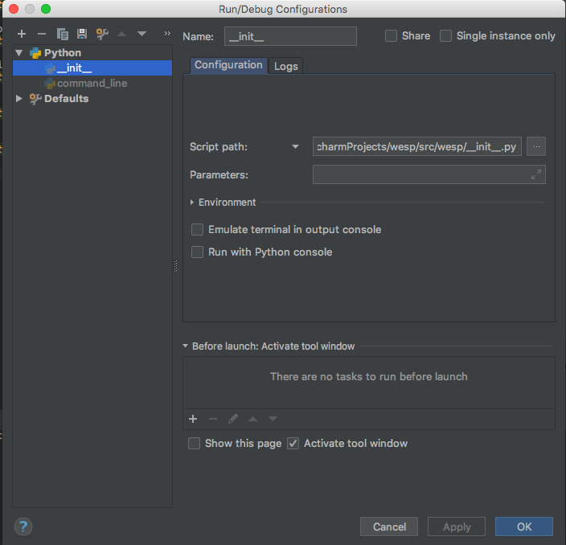  
  
16. Changes can directly be committed and pushed to GitHub. More information can be found [here](https://www.jetbrains.com/help/pycharm/commit-and-push-changes.html).  